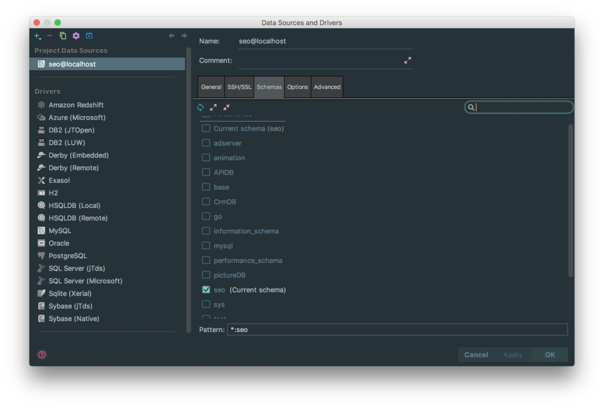
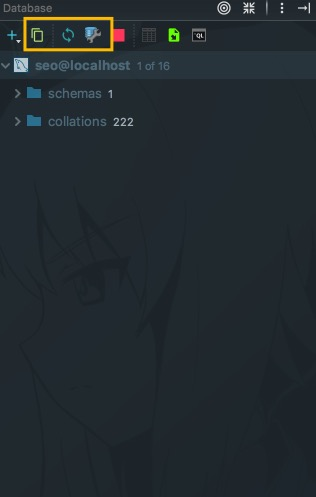

# 数据库管理工具介绍

## 配置 Database 组件的数据库连接

> * 表面上很多人认为配置 Database 就是为了有一个 GUI 管理数据库功能，但是这并不是 Phpstorm 的 Database 最重要特性。数据库的 GUI 工具有很多，Phpstorm 的 Database 也没有太明显的优势。最大的优势是Phpstorm配置好数据库后，Phpstorm就可以给我们的项目提示sql语句了

## Database 设置

> * 如上图标注所示，配置好 Host Databases User Password  选择好数据库  点击OK就行 

> * 如上图标注的红圈所示，这是 Database 常用的三个操作。
>
>> * 第一个按钮是：同步当前数据库连接。这个是最重要的操作，有一些情况下，当我们配置好连接之后，没有显示数据表，那就是需要点击该按钮进行同步。还有一种情况就是我们在 Phpstorm 之外用其他工具操作数据库，比如新建表。而此时 Phpstorm 的 Database 如果没有同步到新表，也是需要点击此按钮进行同步的。
>> * 第二个按钮是：配置当前连接，跟我们首次设置连接的界面是一样的。
>> * 第三个按钮是：断开当前的连接。

