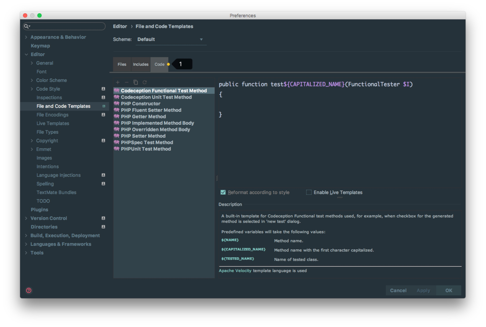

# 文件代码模板的使用

## 文件代码模板的设置

> * 如上图标注 1 所示，文件代码模板支持的类型基本常见的文件类型都涵盖了。
> * 如上图标注 2 所示，这是 文件模板新建的代码模板，其中下面的 `$FILE_NAME}、${USER}` 是 Phpstorm 预设的变量。
> * 如上图标注 3 所示，介绍当前文件模板的一些信息，以及一些预设变量的作用介绍。
> * 如上图标注 4 所示，这四个按钮是文件代码模板的主要操作按钮，四个操作分别是：
>
> > * `Create Template` 创建一个文件代码模板。 
> > * `Remove Template` 删除一个文件代码模板，标注 1 所示的这些预设模板是不允许删除的，只能能删除预设之外的新增的。
> > * `Copy Template` 复制一个文件代码模板。 
> > * `Reset To Default` 对被修改的预设文件代码模板，还原到默认状态。

> * Includes 一般是文件里面的Doc文档的生成

> * 因为 `Code` 模块改动的人不多，所以放在最后。我们是无法新建、删除 `Code` 里面的代码模板。
> * 如上图标注 1 所示，在我们通过快捷方式生成某个类的测试方法时候会自动调用此 `Code` 模板，所以我们可以解释该 `Code` 功能主要用在 Phpstorm 自动帮我们生成某些代码的时候引用的模板。

## 文件代码模板预设的变量

因为变量的命名太明了不过了，所以这里不多讲解，直接贴出官网的英文解释：

> * ${PACKAGE_NAME} - the name of the target package where the new class or interface will be created.
> * ${PROJECT_NAME} - the name of the current project.
> * ${FILE_NAME} - the name of the PHP file that will be created.
> * ${NAME} - the name of the new file which you specify in the New File dialog box during the file creation.
> * ${USER} - the login name of the current user.
> * ${DATE} - the current system date.
> * ${TIME} - the current system time.
> * ${YEAR} - the current year.
> * ${MONTH} - the current month.
> * ${DAY} - the current day of the month.
> * ${HOUR} - the current hour.
> * ${MINUTE} - the current minute.
> * ${PRODUCT_NAME} - the name of the IDE in which the file will be created.
> * ${MONTH_NAME_SHORT} - the first 3 letters of the month name. Example: Jan, Feb, etc.
> * ${MONTH_NAME_FULL} - full name of a month. Example: January, February, etc.

> * 官网变量介绍：<https://www.jetbrains.com/idea/help/file-template-variables.html>
