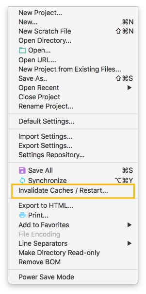
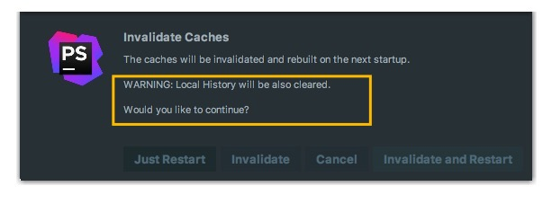

# 缓存和索引介绍和清理方法

## 缓存和索引介绍

在之前的章节里已经点到了首次加载项目的时候，都会创建索引，而创建索引的时间跟项目的文件多少成正比。在创建索引过程中，即使你编辑了代码很多提示也是看不到的，使用效果并不好，所以还是安安静静等创建索引完成。

缓存和索引主要是用来加快文件查询，从而加快各种查找、代码提示等操作的速度，这某些特殊条件下，缓存和索引文件也是会损坏的，比如断电、蓝屏引起的强制关机，当你重新打开基本上百分八十的可能 都会报各种莫名其妙错误，甚至项目打不开，主题还原成默认状态。也有一些即使没有断电、蓝屏，也会有莫名奇怪的问题的时候，也很有可能是 缓存和索引出问题，这种情况还不少。遇到此类问题也不用过多担心，下面就来讲解如何解决。

## 清除缓存和索引

> * 标题栏 -&gt; File 已经自带提供清除缓存、索引的路口，如上图标注 1 所示。

> * 一般建议点击 `Invalidate and Restart`，这样会比较干净。
> * 但是有一个需要提醒的是，如上图圈标注的地方：清除索引和缓存会使得 IntelliJ IDEA 的 `Local History` 丢失，所以如果你项目没有加入到版本控制，而你又需要你项目文件的历史更改记录，那你最好备份下你的 `LocalHistory` 目录。目录地址在：Windows:  `C:\Users\当前登录的系统用户名\.PhpStrom\system\LocalHistory`  MacOs:  `~/Library/Caches/PhpStormXX/LocalHistory`建议使用硬盘的全文搜索，这样效率更高。

通过上面方式清除缓存、索引本质也就是去删除 C 盘下的 `system` 目录下的对应的文件而已，所以如果你不用上述方法也可以删除整个 `system`。当 IntelliJ IDEA 再次启动项目的时候会重新创建新的 `system` 目录以及对应项目缓存和索引。

如果你遇到了因为索引、缓存坏了以至于项目打不开，那也建议你可以直接删除 `system` 目录，一般这样都可以很好地解决你的问题。

## 其他

> * 所以如果你 C 盘空间不足的情况下，最好转移下 `system` 目录，可以根据之前的[相关核心文件和目录介绍](an-zhuang-hou-sheng-cheng-de-mu-lu-shuo-ming-vm-she-zhi.md)进行配置。

