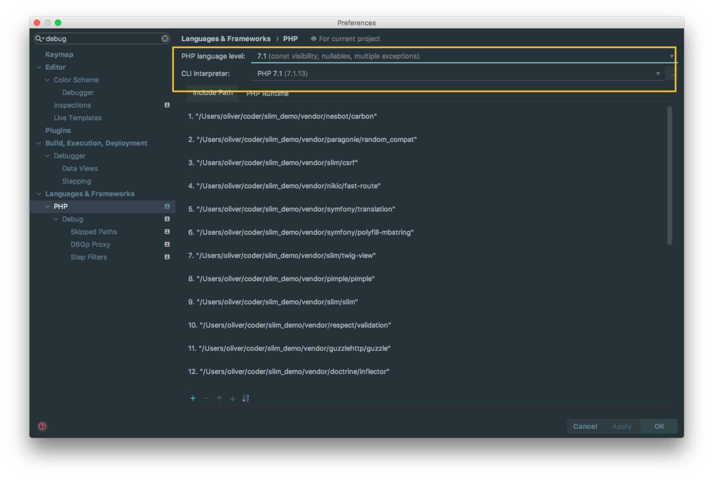
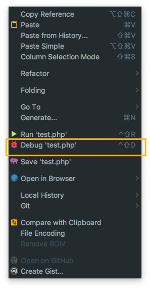
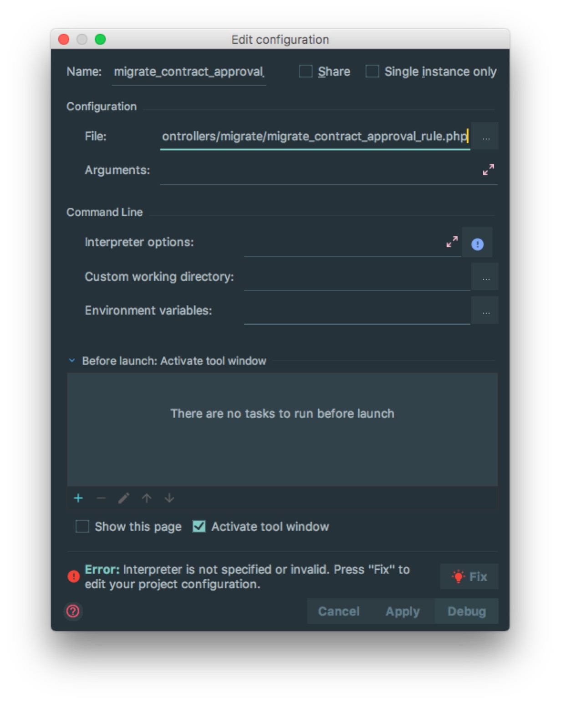
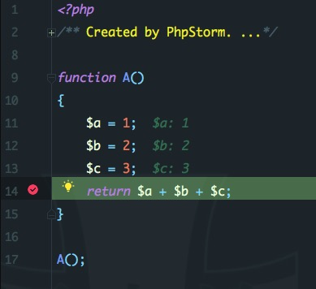
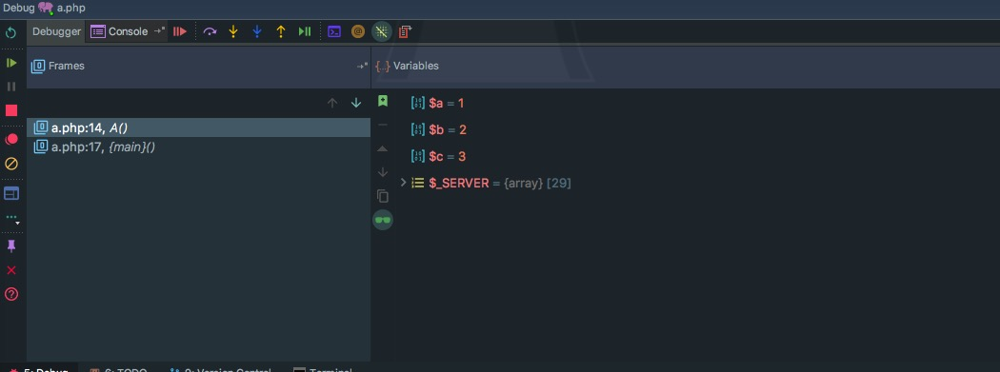

# 脚本debug

## 配置 脚本debug

> * 在setting配置中搜索debug关键词，选择好debug时php的版本号以及CLI所在的位置

 

> * 在当前的脚本文件单击右键，如果之前配置好上图中PHP版本和CLI,直接点击Debug进行debug，如果没有需要点击Fix去配置上图中PHP版本和CLI

## 添加断点调试

> * 点击左侧部分，可以看到红点，此为断点的位置，进行debug时，程序运行到此会停止。会显示之前变量的参数

> * 左侧:  
>
>   绿色三角形 ： Resume Program，表示將继续执行，直到下一个中断点停止。
>
>   红色方形     ： Stop，表示中断当前程序调试。
>
> * 上方
>
>   一个图形示 ： Step Over，跳过当前函数。
>
>   二个图形示 ： Step Into，进入当前函数內部的程序（相当于观察程序一步一步执行）。
>
>   三个图形示 ： Force Step Into，強制进入当前函数內部的程序。
>
>   四个图形示 ： Step Out，跳出当前函数內部。
>
>   五个图形示 ： Run to Cursor，定位到当前光标。
>
> * 框架说明
>
>   Frames    : 加载的文件列表
>
>   Variables ： 可以观察到所有全局变量、当前局部变量的数值

