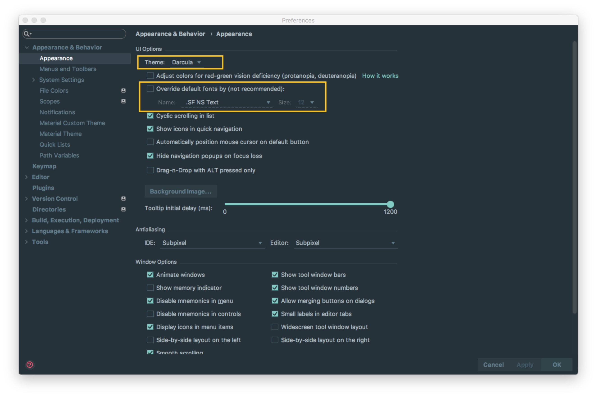
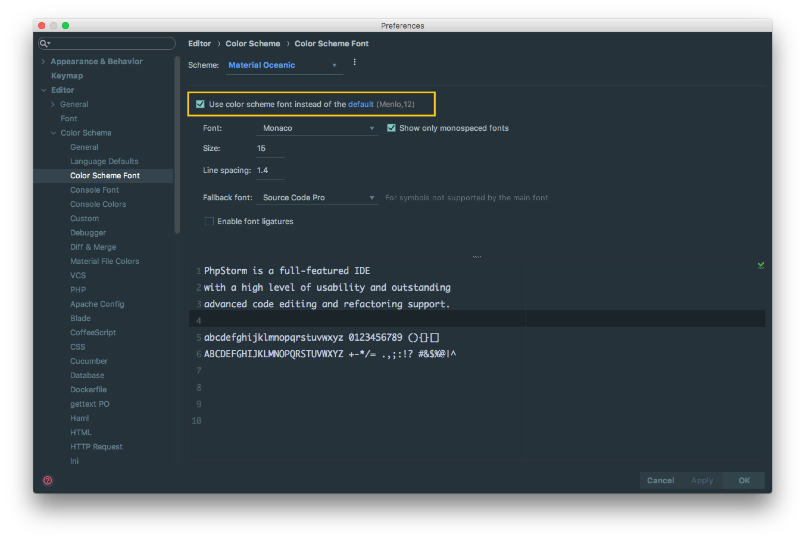
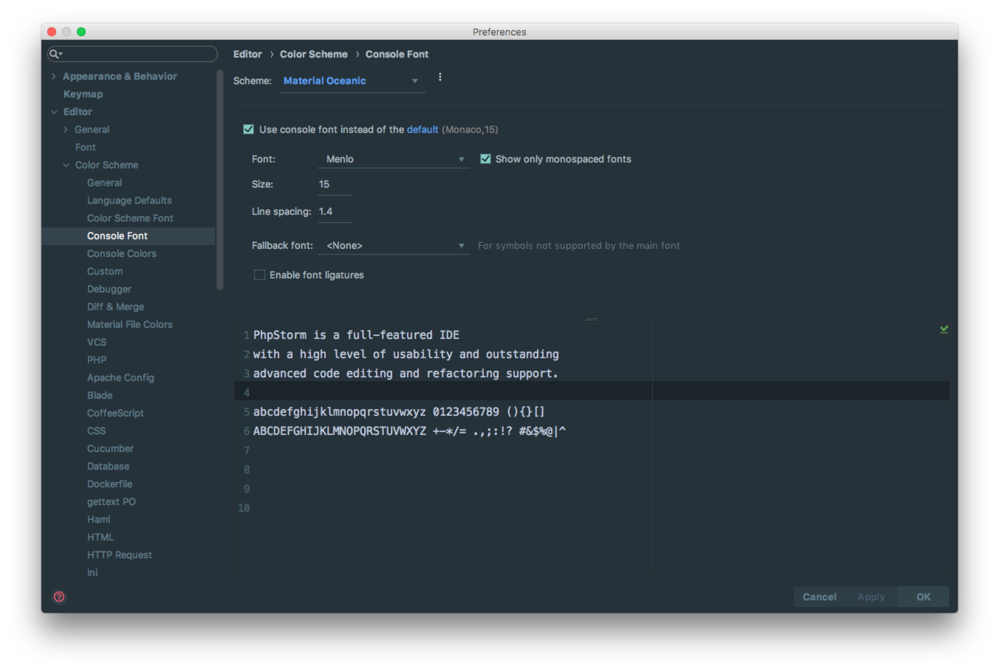
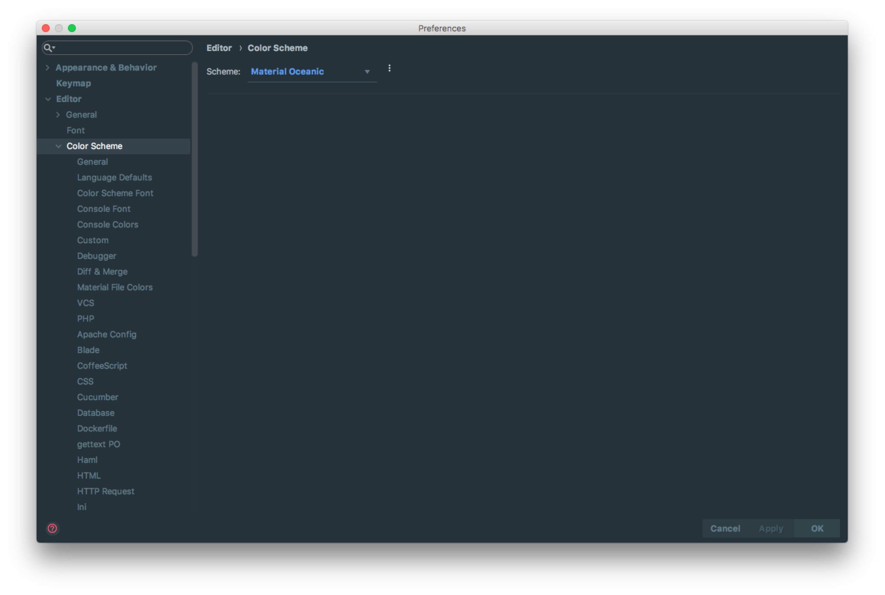
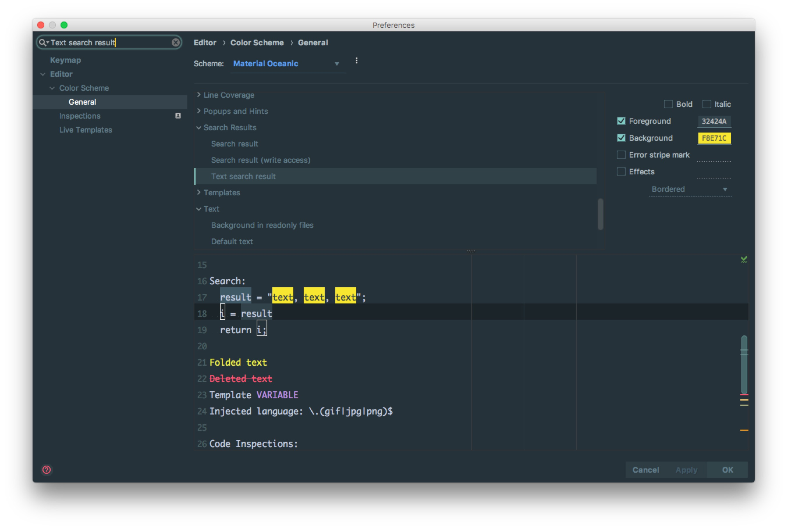
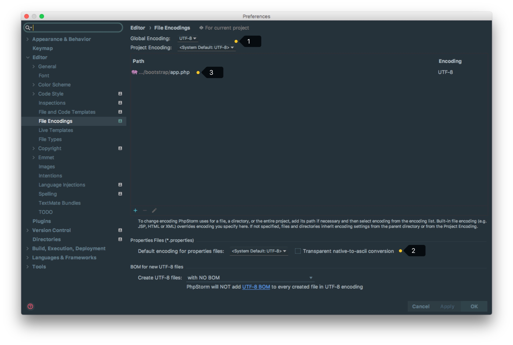

# UI 主题、字体、编辑区主题、文件编码修改、乱码问题

## 主题修改

> * Windows: File -&gt; Setting。 MacOs: Phpstrom-&gt;Preferences

## 字体修改

### 主题字体修改

> * 如上图 所示，主题字体的修改要先勾选 `Override default fonts by` 。默认 IntelliJ IDEA 是不推荐修改的，但是由于字体是有分包含中文和不包含中文之分的，一般使用英文的国家是不需要额外担心乱码问题的，而我们需要。
> * 字体的审美上每个人不一样，但是如上一段说的，这里的字体修改是需要知道一个前提的，那就是你选择的那个字体必须含有中文，比如微软雅黑和宋体这类是包含中文的，而 `Courier New` 和 `Monaco` 这类只是单纯的英文字体。
> * 如果你选择的字体不包含中文，那可能会在很多位置上出现类似 `口口口口口` 这样的乱码问题，比如文件名含有中文、字体是中文名字的都会变成 `口口口口口`。
> * 在修改主题字体的时候，不建议把字体调成很大，因为很多人遇到这样一种情况：显示器分辨率低，主题字体又大，在某些操作的工具菜单、右键菜单选项中部分选项超出了分辨率显示范围，没办法被选中。当然了，如果你一定要把字体改大，又不用大分辨率显示器，那可以通过  `Menus and Toolbars` 删除部分你认为用不到的菜单，但是一般不建议这样做。
> * 还需要特别注意的时候，如果你是开着的时候，新装了一个字体的话，那必须重启之后才能在下拉列表找到新装的字体。

### 代码编辑字体修改

> * 如上图 所示，勾选的 `Show only monospaced fonts` 表示筛选显示系统上的等宽字体。由于 Windows 系统上等宽字体并不多，勾选此选项出现的下拉字体可选择就很少。取消勾选之后，就可以显示系统上所有已安装的字体。
> * 如上图 所示，其中编码字体有第一字体和 第二字体（`Fallback font`）之分。当有些字符在第一字体支持不了的时候，会去使用第二字体进行支持。
> * 个人习惯上：英文字体使用 `Monaco`，由于此字体不支持中文，所以我把这个设置为第一字体，第二字体不使用。
> * 如果你的第一字体不包含中文的话，第二字体包含中文，那在有些地方也还是会出现 `口口口口口` 这类问题，比如进行查找文件的时候，如果你输入中文也会变成 `口口口口口` ，我个人文件名为中文的不多，所以就容忍了这种情况。如果你不愿意容忍这种情况，那还是回到最开始的要求：第一字体包含中文。

### 控制台输出字体修改

## 编辑区主题修改

### 编辑区主题介绍

> * 编辑区主题，也就是代码书写区的主题修改。基本上大家在 `General` 上都有对此进行小修小改，我下面也主要介绍下我个人在 `General` 上常修改的一些地方，其他特性的颜色修改我一般默认，但是修改方法原理一样。
> * 对于编辑区的主题，也有人制作成模板在网络上提供下载。这里主要介绍两个站点：
>
> > * [http://color-themes.com/?view=index](http://color-themes.com/?view=index)，主要提供 jar 文件下载。
> > * [http://www.phpstorm-themes.com/](http://www.phpstorm-themes.com/)，主要提供 xml 和 icl 文件下载。
> > * 对应文件如何安装请查看网站对应的 `Help` 页面，都有详细说明的。

### 编辑区主题细节修改

> * 常用的修改的有（善用搜索功能）：
>
> > * `Default text`，指的是默认代码文本，我一般会修改其 `Background` 属性。
> > * `Caret row`，指的是光标所在行，我一般会修改其 `Background` 属性。
> > * `Identifier under caret`，指的是光标所在位置的相同标识符呈现什么效果，我一般会修改其 `Background` 属性。
> > * `Text search result`，指的是在查找模式下，匹配字符的样式，我一般会修改其 `Background` 属性。

## 文件编码修改

> * 上图标注 1 所示，全局和当前项目下的编码模式。但是一般建议为 `UTF-8`，也就是默认。
> * 上图标注 2 所示，可以对 `Properties` 文件进行专门的编码设置，一般也建议改为 `UTF-8`，其中有一个重点就是属性 `Transparent native-to-ascii conversion`，对于 `Properties` 文件，重要属性 `Transparent native-to-ascii conversion` 主要用于转换 `ascii`，一般都要勾选，不然 `Properties` 文件中的注释显示的都不会是中文。（对于这块不是很理解，一般我使用默认）
> * 上图标注 3 所示，除了支持对整个 Project 设置编码之外，还支持对目录、文件进行编码设置。如果你要对目录进行编码设置的话，可能会出现需要 `Convert` 编码的弹出操作选择，**强烈建议** 在转换之前做好文件备份，不然可能出现转换过程变成乱码，无法还原。

## BOM头问题

> * 由于 UTF-8 编码文件有分 `有BOM` 和 `无BOM` 之分，编辑器默认是添加`无BOM`的文件，如果`有BOM`会导致输出的字符串不能`json_decode`解析
> * 批量去除 BOM，你可以 Google：`批量去除 BOM`、`批量转换无 BOM` 等关键字，网络上已有提供各种方案。
> * 如果上述问题都无法解决，而且你也确认 各个配置编码的地方都是 `UTF-8无BOM`，那还有一种可能也会出现这种情况：项目配置文件有问题。项目编码的配置文件在：`/项目目录/.idea/encodings.xml`。如果你会修改此文件可以进行修改，如果不会，那就删除掉 `.idea` 整个目录，重启重新配置这个项目即可。

