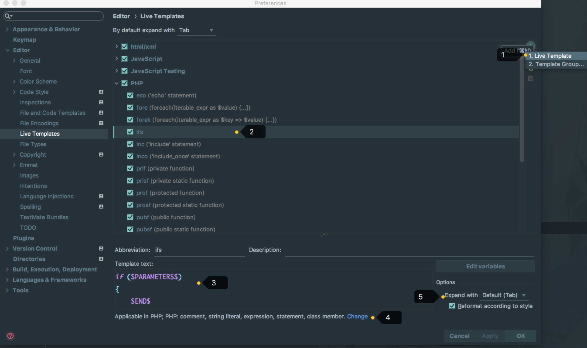
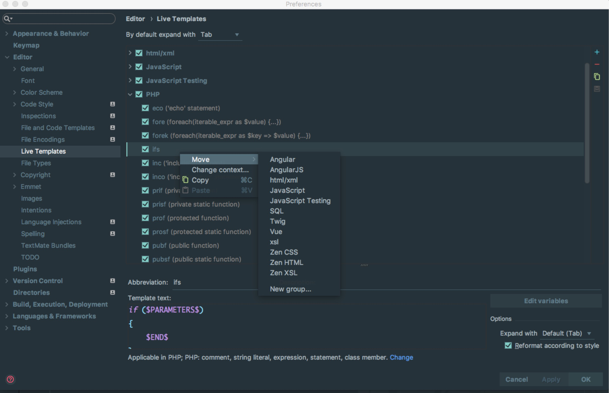
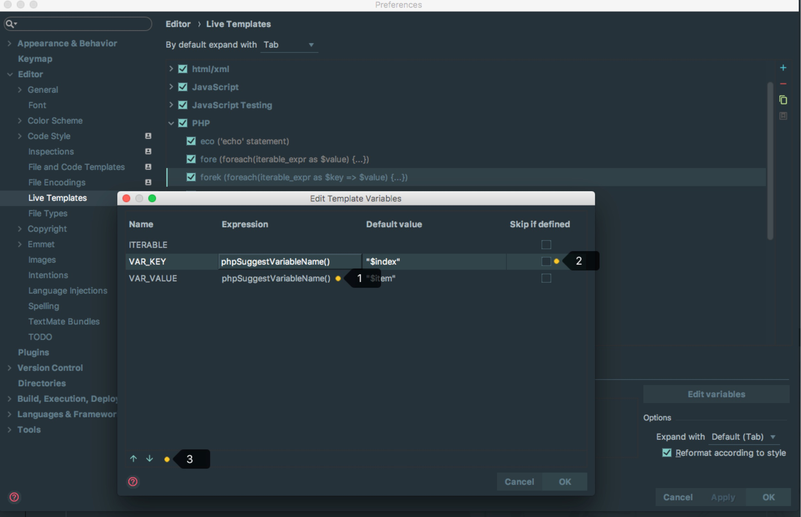

# 实时代码模板

## 实时代码模板的介绍

> * 综上效果：实时代码模板只是为了让我们更加高效的写一些固定模式的代码，以提高编码效率，同时也可以增加个性化。比如 Gif 演示中，我在开发中如果需要写输出的话，我个人习惯输出语句中前缀是自己的标记：横线和域名，以区分其他人输出，方便做全文搜索。
> * 官网介绍 `Live Templates`：[https://www.jetbrains.com/help/phpstorm/live-templates.html](https://www.jetbrains.com/help/phpstorm/live-templates.html)
> * Phpstorm 的实时代码模板保存在 `/templates` 目录下，其他系统目录位置如下：（因为目录名在各个系统上是一致的，建议用硬盘搜索工具搜索即可）
>
> > * Windows: `C:\Users\XXXX\.PhpstromXX\config`
> > * Linux: `~/.<product name><version number>/config/templates`
> > * OS X: `~/Library/Preferences/PhpstromXX/templates`

调用常规的实时代码模板主要是通过两个快捷键：`Tab` 和 `Ctrl + J`。虽然 Phpstorm 支持修改此对应的快捷键，但是默认大家都是这样使用的，所以没有特别原因就不要去改。

该两个快捷键的使用方法：如第一张 Gif 演示图所示，在输入 `pubf` 后按 `Tab` 键，即立即生成预设语句。如果按 `Ctrl + J` 则会先提示与之匹配的实时代码模板介绍，然后还需按 `Enter` 才可完成预设语句的生成。

## 自带变量参数介绍

在文章开头我们已经有提到 Phpstorm 实时代码模板是有变量参数设置的，其中 Phpstorm 自带了两个变量参数：

> * `$END$`，表示最后都编辑完后光标所处的位置
> * `$SELECTION$`，表示设置环绕实时代码模板，环绕功能下面会模板专门进行介绍。
> * 除了上面两个变量参数外，其他一律都会自定义变量。
> * 官网介绍：[https://www.jetbrains.com/help/phpstorm/live-template-variables.html](https://www.jetbrains.com/help/phpstorm/live-template-variables.html)
>
> > * `$END$` indicates the position of the cursor after the template is expanded.
> > * `$SELECTION$` is used in surround templates and stands for the code fragment to be wrapped.

## 实时代码模板的设置

> * 如上图标注 1 所示，除了预设的模板之外，我们还可以创建新组和新实时代码模板，其中组是用来包含实时代码模板的。
> * 如上图标注 2 所示，`PHP` 是组名，告诉开发者，这组里面实时代码模板都是用来做输出的。`ifs` 表示实时代码模板输出 `if` 的简称，所以这个不是一个完整的单词，不需要读懂，只需要记忆。
> * 如上图标注 3 所示，实时代码模板的内容，其中用到了预设的变量 `$END$`。 
> * 如上图标注 4 所示，可设置该实时代码模板的试用范围。点击选择适用范围
> * 如上图标注 5 所示，勾选了辅助的功能：
>
> > * `Reformat according to style` 对生成的代码进行格式化。

> * 如上图标注所示，我们可以对实时代码模板进行组的转移。

## 变量参数和函数的介绍

> * 如上图标注 1 所示，演示中变量名 `$VAR_KEY$`、`$VAR_VALUE$` 输出默认值`$index` 和`$item`，对着两个变量的处理方式是用php中变量提示的函数来处理的。
> * 如上图标注 2 所示，如上面介绍的，每个变量都是一次光标位置，勾选了 `Skip if defined`，则光标不会进入。 
> * 如上图标注 3 所示，可以改变变量光标跳转时的顺序。
> * 内置函数介绍：[https://www.jetbrains.com/help/phpstorm/live-template-variables.html](https://www.jetbrains.com/help/phpstorm/live-template-variables.html)
>
> > * 对于官网这些函数这里就不在累赘，官网有详细的介绍，如果你还看不懂，可以看 Phpstorm 已经预设各个实时代码模板，基本上常用的函数都有被引用过，你可以通过学习这些预设的实时代码模板来揣测其函数的用法。

## 环绕功能介绍

> * 上图 Gif 演示为最好的介绍 `surround templates`。
> * 如上图 Gif 演示，环绕模板的前提是：选中要被环绕的内容。
> * 在设置实时代码模板的时候，如果含有预设的变量 `$SELECTION$` 则该实时代码模板是环绕模板。
> * 该功能对于前端开发者来讲是非常方便的，默认 Phpstorm 已经自带了 HTML 标签的环绕功能。
> * 快捷键为 command + alt + t

