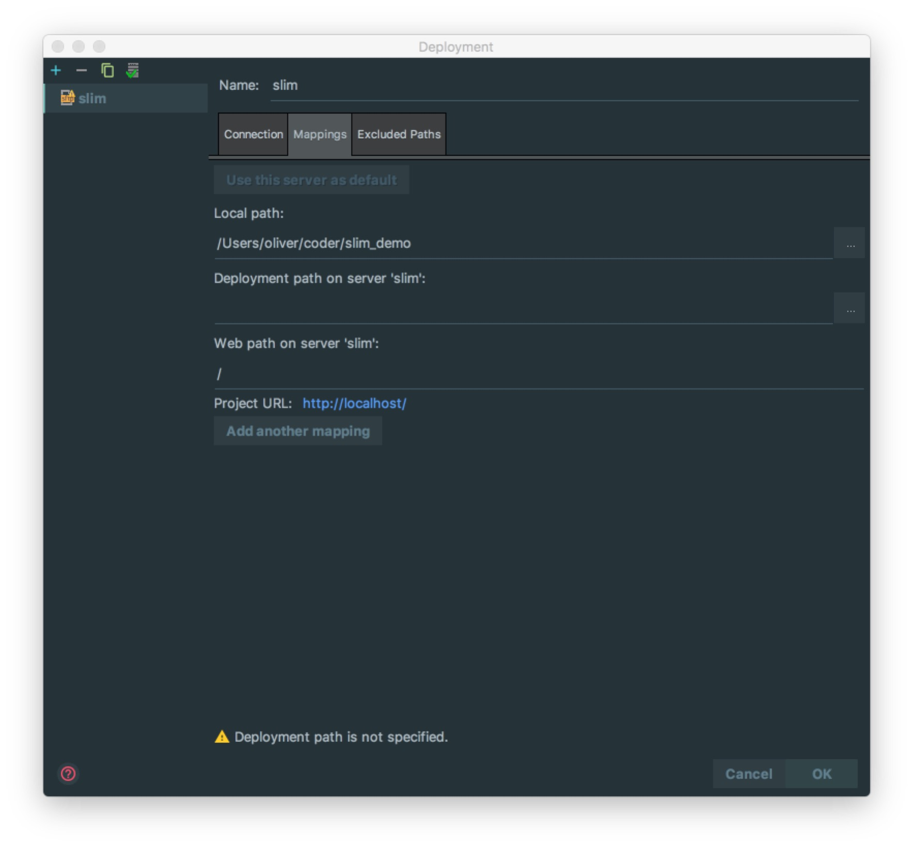
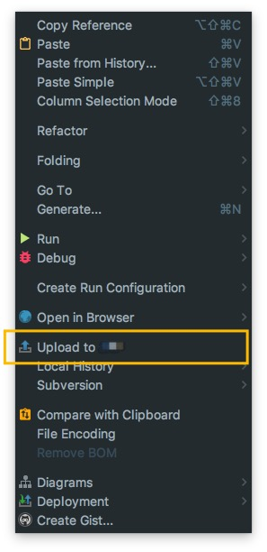

# 远程文件的上传

## 配置上传文件

> * 选择上传文件的配置， 添加一个新的上传配置

## 上传文件设置

> * 如上图标注所示，填写好需要上传的SFTP/FTP的账号密码，Root path 表示在服务器上某个文件夹设置为根目录，选择好后会展示该目录下的所有文件。

> * Mapping 表示本地和服务器上文件的映射关系。设置好后，可以手动或者自动的把文件上传到服务器对应的文件上去。只需要把第二个服务器地址填写好即可实现文件的对应。

> * 成功后会展示远程地址的目录，绿色部分是mapping的对应关系

> * 右键能够找到上传，点击后上传到服务器上

