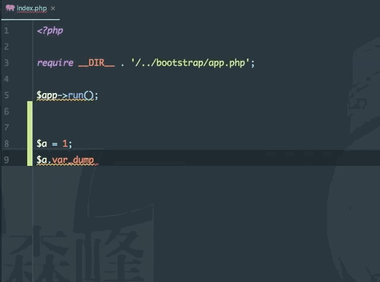
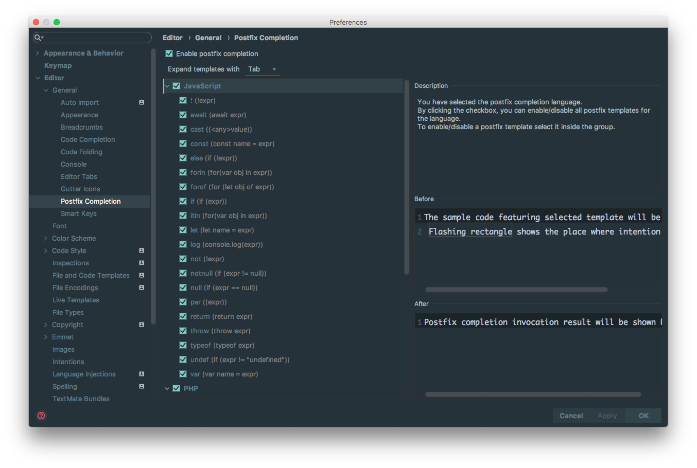

# Postfix Completion 的使用

## Postfix Completion 的介绍

Postfix Completion 功能本质上也是代码模板，只是它比 Live Templates 来得更加便捷一点点而已。具体它是做什么的，我们通过下面一张 Gif 演示图来说明：

## Postfix Completion 的设置

> * 如上图红圈所示，Phpstorm 只提供了是否启用的开关，其他的设置就没了。所以如果目前的版本中你还无法想对该功能进行自定义。Phpstorm 也对常用到的一些固定格式的代码进行了归纳，基本目前也够用了。

