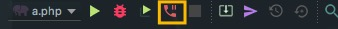

# web debug

## 调试原理


> * 上图为xdebug+Phpstorm的基本调试原理

## 配置调试环境

> * 配置 xdebug
 ```shell
 	[xdebug] 
 	zend_extension="/usr/local/opt/php70-xdebug/xdebug.so"
	xdebug.remote_enable=1          # 启用远程调试
	xdebug.remote_connect_back=1    # 忽略 remote_host 配置, 不关注主机配置, 开发者使用最舒服
	xdebug.remote_port=9050         # 监听端口
 ```

> * 设置 phpstorm 配置并开启监听
> > 我们这里监听的是 9500 端口, 和 xdebug 配置监听数据端口一致

   

> * 开启phpstorm 数据监听
> > 切换 “开始监听PHP调试连接” 按钮。

   
   

> * 在 phpstorm 中设置断点
> > 点击行号右侧空白, 设置断点

 

> * 设置 debug session
>  debug session 的工具的目的是设置一个cookie, 让每次发送数据的时候都会携带这个 cookie, 从而识别监听.

> > * 安装工具
> > 安装 chrome 扩展 Xdebug helper


> > * 点击 图标设置session


> > 已经设置了cookie, Key 是 XDEBUG_SESSION, 值是 PHPSTORM, 这里的值无关紧要, 对于 phpstorm 来说, 是能够监控到的.


> * 运行页面


## 另一种方式:内部调用
> 这里的另外一种方式的服务器配置方式和流程完全一致, 有所不同是：不是外部设置debug session而是使用phpstrom内部工具调试, 实现的原理是在phpstorm中设置运行的服务器, 然后通过 debug 模式自动设置 XDEBUG_SESSION, 并且自动开启监听.

> * 设置 web 访问的服务器
> > 例如我这里的本地域名是 l.dailian.sour-lemon.com, 我们需要配置一个本地服务器来打开这个页面, 我们首先配置一台服务器.注意 这里的配置的域名是你本地已经配置好开发环境的域名, 端口号是 本地开发所使用的端口, 我这里是 l.dailian.sour-lemon.com 和 80


> * 配置调试页面
>> 我们这里创建的调试页面的类型是 PHP Web Application, 服务器选择的是刚才已经建立好的服务器


> * 运行测试页面
> > 这样运行的情况下上面的 开启phpstorm 数据监听 步骤可以忽略掉, 这里不需要开启这个监听.
> * 开始 debug
> > 点击 debug 按钮, 这里会自动打开一个页面并且传递一个唯一的ID(可能是进程 ID)作为 debug 值,打开的url地址是: l.dailian.sour-lemon.com/?XDEBUG_SESSION_START=13608, 这里的数值是会变动的.
> * 查看 debug 面板
>> 打开 debug 面板, 会看到相对应的监听 idekey, 这里和上一步设置的key是一致的, 同样也和 cookie 中的设置的 XDEBUG_SESSION 值一致


## 其他
> 查看兼容性
> > 第一次运行的时候可以通过 phpstorm 自带的工具来检查配置的兼容性.
> > Run > Web Server Debug Validation


